# MidTerm Writeup

## Range Image

### Sequence 1

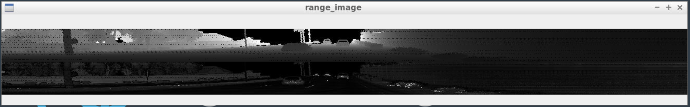

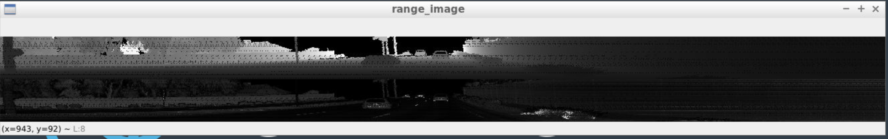

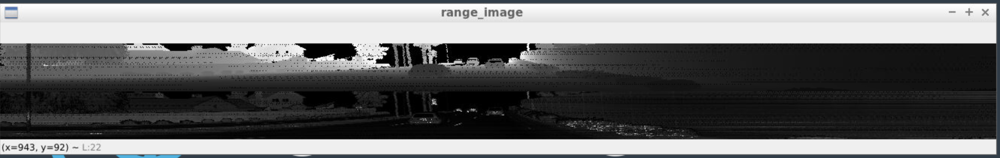

 
 
 

### Sequence 3

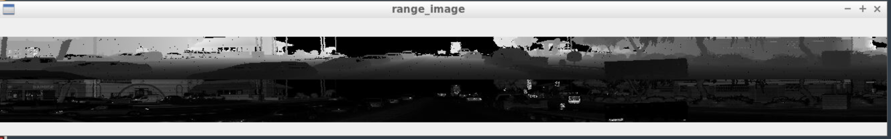

 
 
 

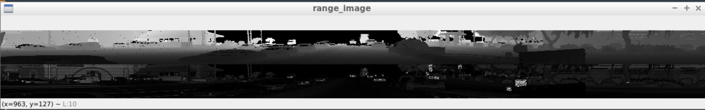

 
 
 
 
 
 

## varying degrees of visibility in the point-cloud

Below are few examples for varying degrees of visibility in the point-cloud.

### Image in short distance with many features visible

Vehicles closer to sensor have more features visible.

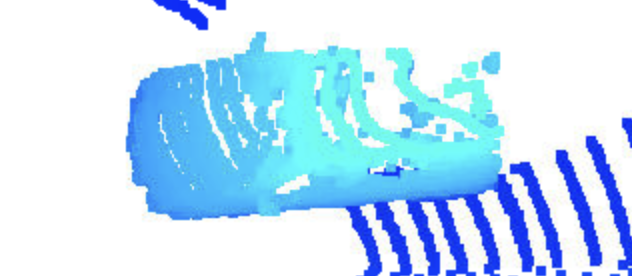

 
 
 

### Image in long distance with only few features visible

Vehicles farther away from sensor have only few features visible.

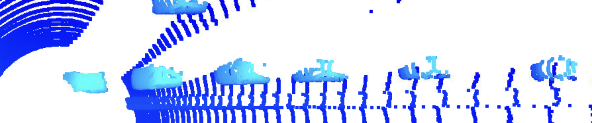

 
 
 

### visibility affected due to one vehicle blocking another

Visibility of one vehicle could be blocked by other vehicle.

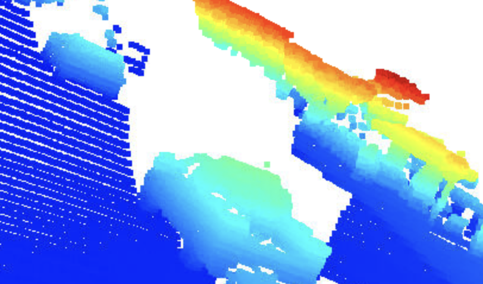

 
 
 

### side features of a near by vehicle 

Features of a side of a car for a vehicle close by.

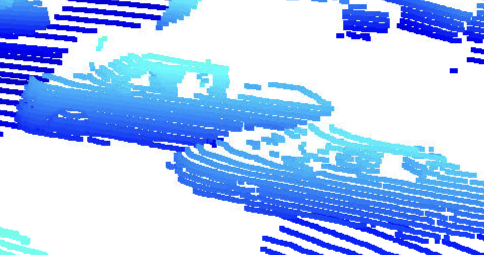

 
 
 

### side features of a far vehicle 

Features of a side of a car for a vehicle far away.

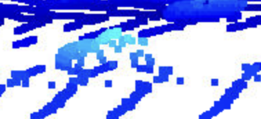

 
 
 

### visibility affected by blindspot

visibility could be affected if another car is in blindspot with respect to sensor.

 
 
 

### visibility affected by trees

visibility could be affected by objects like trees.

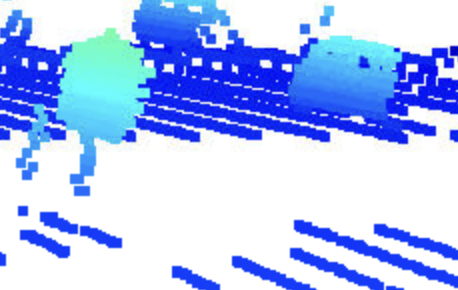

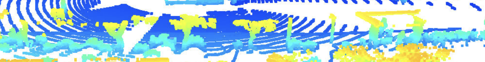

 
 
 

### visibility affected by lighting conditions

Different lighting conditions could cause images to look different.

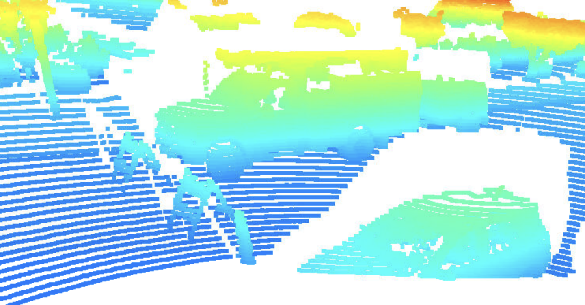

 
 
 

### other objects like billboards

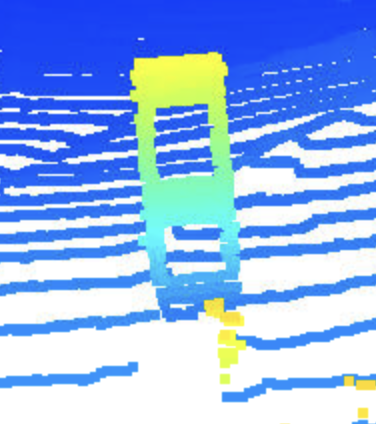

 
 
 
 
 
 

## stable feature on most vehicles

### Windshield
 

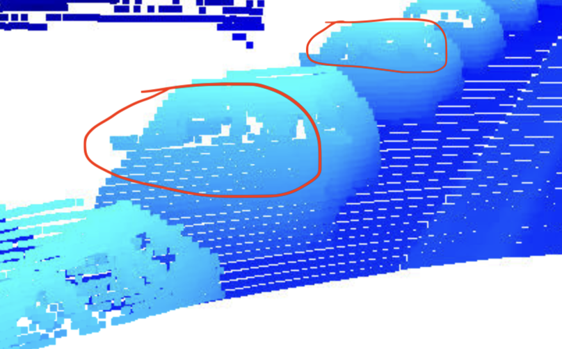

 
 

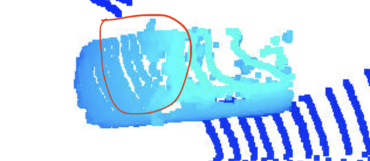

 
 

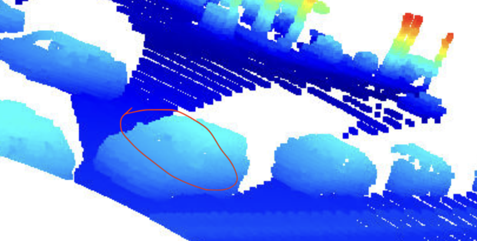

 
 

### Tires
 

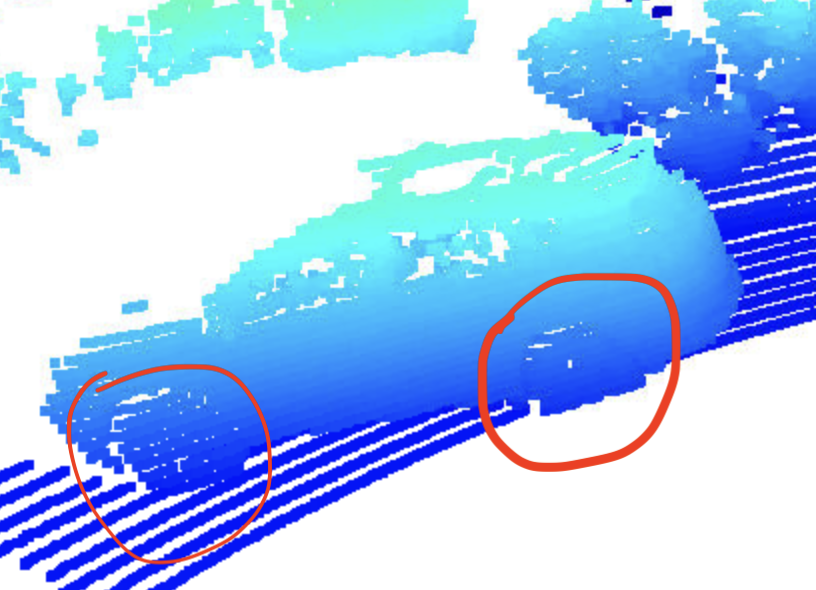

 
 

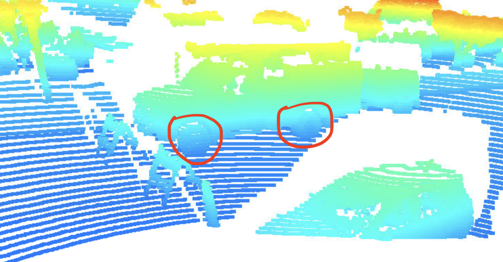

 
 

### Side doors
 

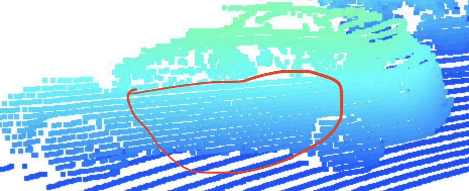

 
 

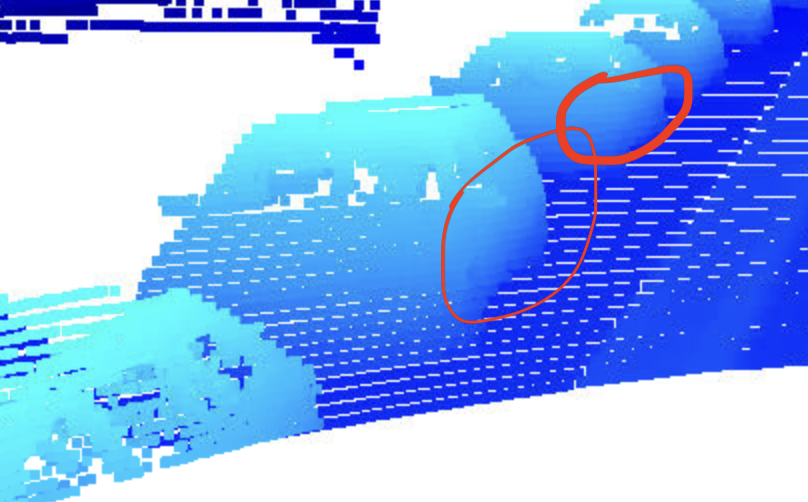

 
 

### Side windows
 

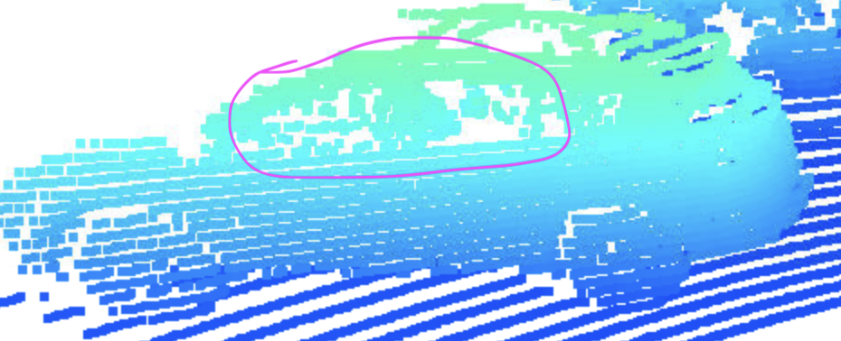

 
 

 
 

### Rear bumper
 

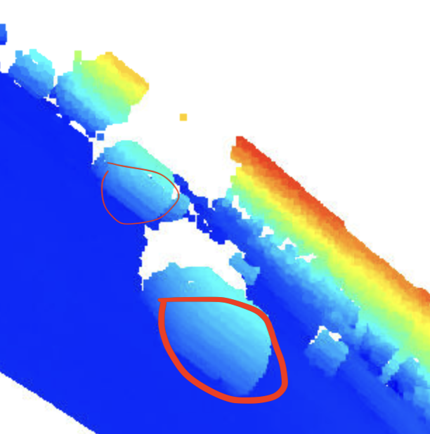

 
 

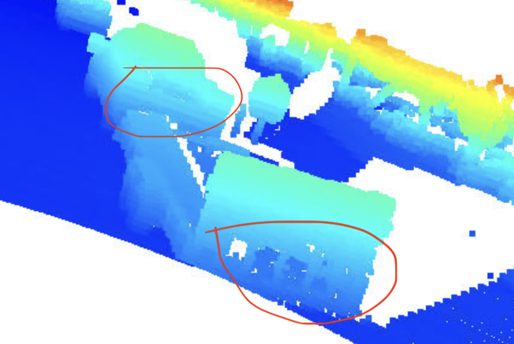

 
 

### Side mirrors
 

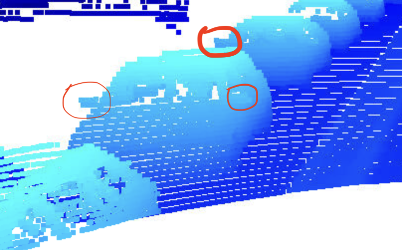

 
 

 
 

 
 

 
 

### others objects like construction symbol 
 

 
 
 
 

 
 

## Birds Eye View 
 

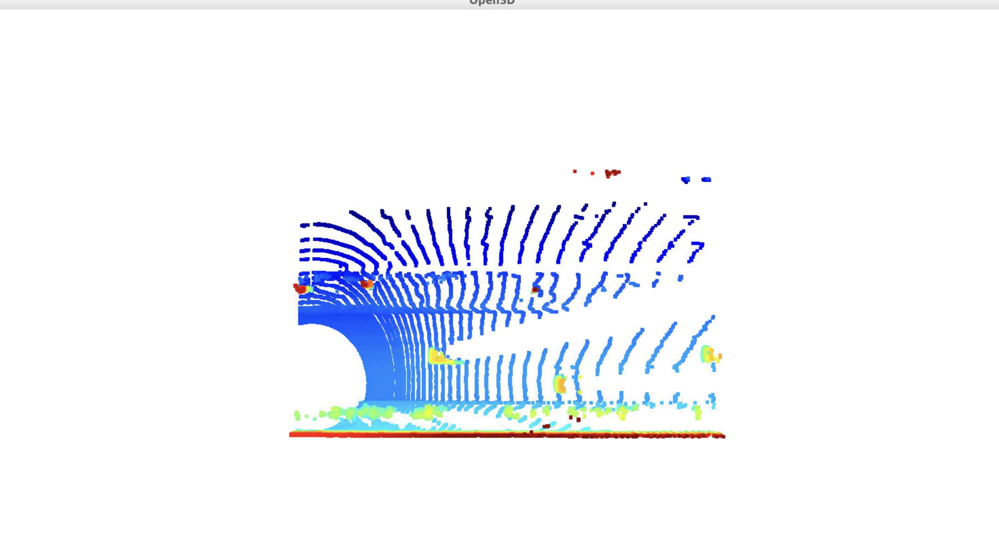

 
 
 
 

## Image Intensity / Image Height
 

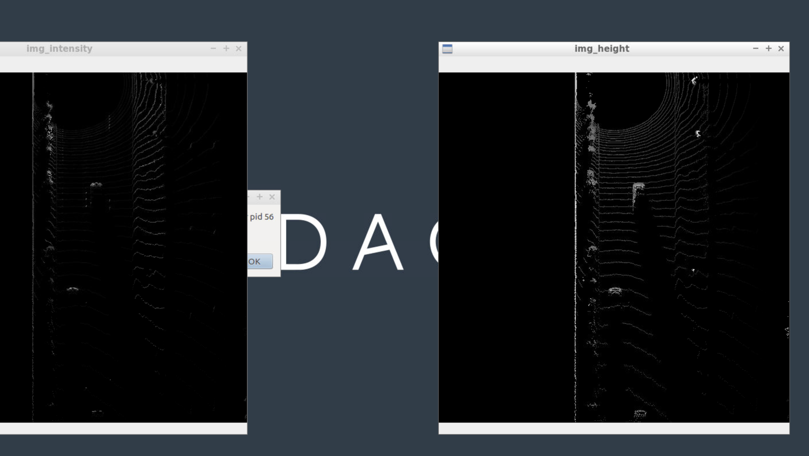

 
 
 
 

## Labels vs detected

 

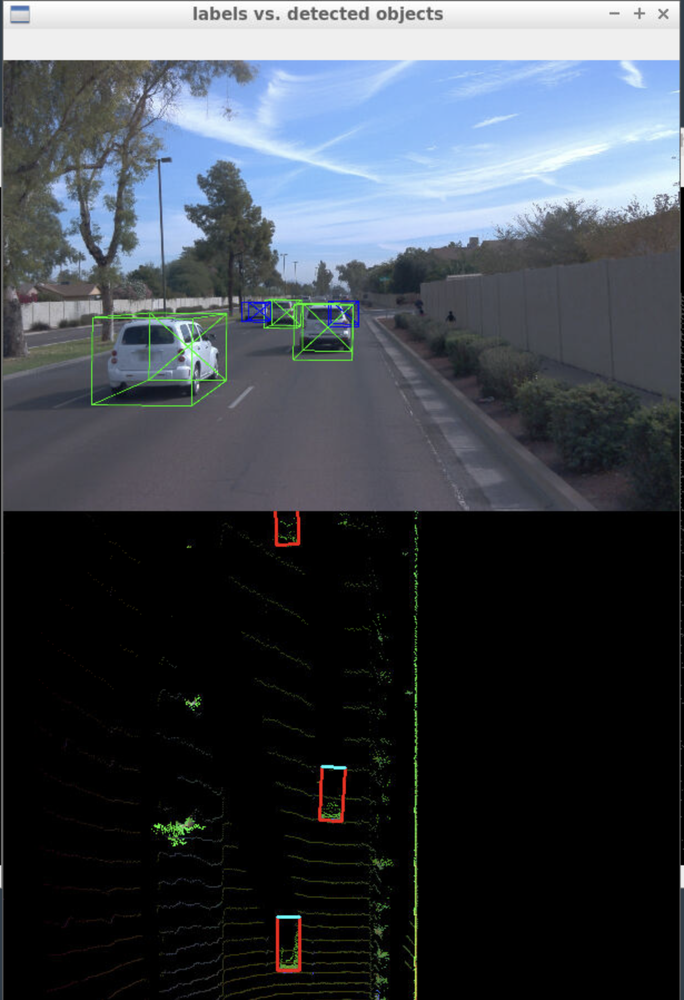

 
 
 
 